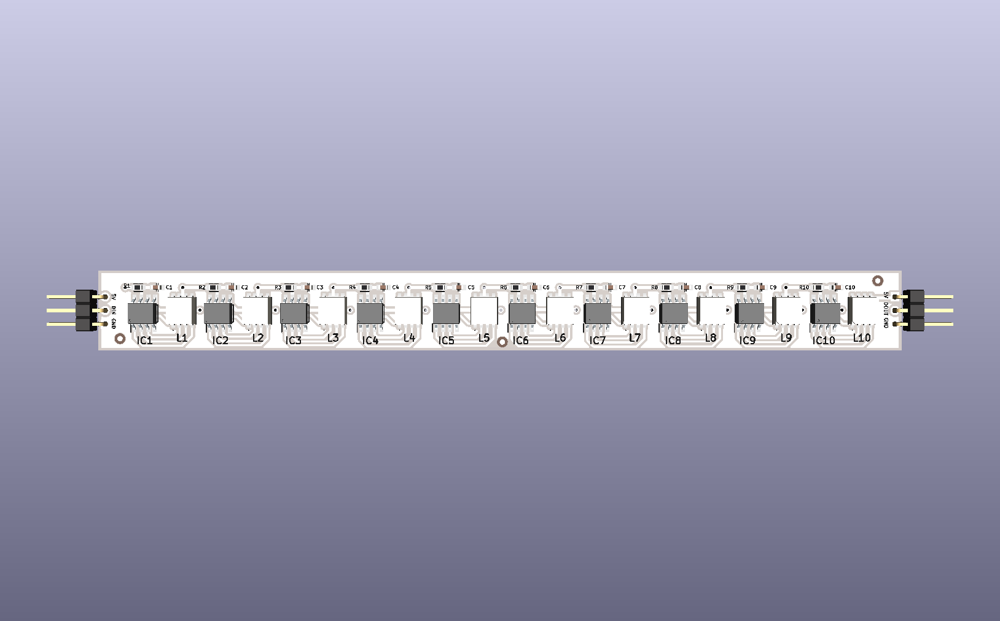
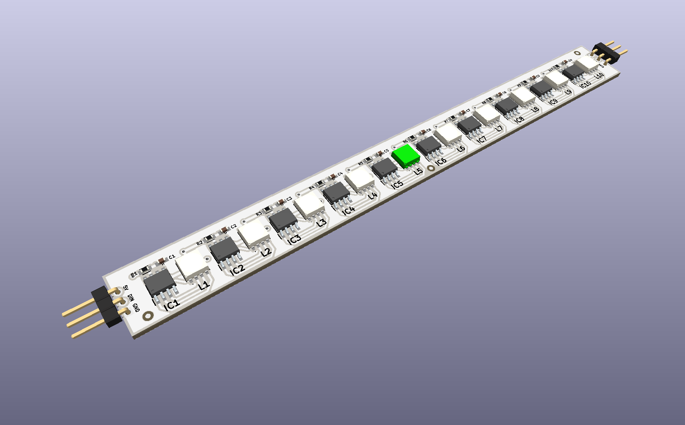

<div align="center">



# WS2814A

**Barra de LEDs endereçáveis RGBW com 10 pixels WS2814C — protocolo de 1 fio, encadeável, totalmente SMD, alimentação 5V**

[](https://www.kicad.org/)
[](.)
[](.)
[](.)
[](.)
[](.)
[](.)

</div>

---

## 📋 Índice

- [WS2814A](#ws2814a)
  - [📋 Índice](#-índice)
  - [Visão Geral](#visão-geral)
  - [Renders 3D](#renders-3d)
  - [Funcionalidades](#funcionalidades)
  - [Arquitetura do Pixel](#arquitetura-do-pixel)
  - [Especificações Técnicas](#especificações-técnicas)
  - [Lista de Materiais](#lista-de-materiais)
  - [Pinagem dos Conectores](#pinagem-dos-conectores)
    - [J1 — Entrada (lado esquerdo)](#j1--entrada-lado-esquerdo)
    - [J2 — Saída (lado direito)](#j2--saída-lado-direito)
  - [Encadeamento de Barras](#encadeamento-de-barras)
  - [Aplicações](#aplicações)
  - [Estrutura do Repositório](#estrutura-do-repositório)
  - [Como Usar](#como-usar)
    - [Conexão básica com Arduino / ESP32](#conexão-básica-com-arduino--esp32)
    - [Exemplo com FastLED (Arduino)](#exemplo-com-fastled-arduino)
    - [Exemplo com Adafruit NeoPixel](#exemplo-com-adafruit-neopixel)
  - [Sobre](#sobre)

---

## Visão Geral

**WS2814A** é uma barra de LEDs endereçáveis **RGBW** com **10 pixels** individuais, projetada pela **ZAT ELECTRONIC** utilizando **KiCad 10**. Cada pixel é composto por um controlador **WS2814C** (SMD) e um LED **QBLP679-RGBCW** (RGBW — 5 canais: Vermelho, Verde, Azul e Branco), permitindo controle independente de cor e intensidade por pixel.

A comunicação utiliza o protocolo **single-wire (1 fio)** compatível com a família WS28xx, amplamente suportado por bibliotecas como **FastLED** e **Adafruit NeoPixel**. A barra possui conector de **entrada (DIN)** e **saída (DOUT)** em ambas as extremidades, permitindo **encadeamento de múltiplas barras** em série com um único pino de dados do microcontrolador.

> 💡 O canal **branco dedicado (W)** do LED QBLP679-RGBCW proporciona iluminação branca de alta qualidade sem mistura de cores RGB, ideal para aplicações de iluminação ambiente e fotografia.

---

## Renders 3D

<div align="center">


*Vista superior — 10 pixels RGBW em série, controladores WS2814C e capacitores de desacoplamento*

<br/>



*Vista isométrica — layout compacto SMD com conectores de entrada e saída nas extremidades*

</div>

---

## Funcionalidades

- ✅ **10 pixels RGBW endereçáveis** — controle individual de cor e brilho por pixel
- ✅ **Controlador WS2814C** (SMD) por pixel — protocolo single-wire compatível com WS28xx
- ✅ **LED QBLP679-RGBCW** por pixel — RGBW com canal branco dedicado (5 canais)
- ✅ **Protocolo 1 fio** — compatível com FastLED, Adafruit NeoPixel e similares
- ✅ **Encadeável (DIN → DOUT)** — múltiplas barras em série com 1 único pino de dados
- ✅ **Conector de entrada J1** (5V / DIN / GND) — lado esquerdo da barra
- ✅ **Conector de saída J2** (5V / DOUT / GND) — lado direito para encadeamento
- ✅ **Capacitor de desacoplamento 100nF** por pixel (C1–C10, 0603 SMD)
- ✅ **Resistor de proteção 100Ω** por pixel (R1–R10, 0603 SMD)
- ✅ **3 pontos fiduciais** (FID1–FID3) — referência para montagem SMD automatizada
- ✅ **Alimentação 5VDC** — compatível com fontes USB e reguladores padrão
- ✅ **Layout totalmente SMD** — compacto e adequado para fabricação automatizada

---

## Arquitetura do Pixel

Cada um dos 10 pixels da barra é composto por:

```
         5V ──────────────────────────────────────┐
                                                  │
DIN_n ──[R_n 100Ω]──► WS2814C (controlador)       │
                           │                      │
                     [C_n 100nF]                  │
                           │                     GND
                           ▼
                    QBLP679-RGBCW
                   ┌──────────────┐
                   │  R  G  B  W  │  ← 4 canais independentes
                   └──────────────┘
                           │
                        DOUT_n ──► DIN_(n+1)  (próximo pixel)
```

Os pixels são encadeados internamente em série, do IC1/L1 ao IC10/L10, com o sinal de dados propagando de pixel em pixel até chegar ao conector de saída DOUT.

---

## Especificações Técnicas

| Parâmetro | Valor |
|-----------|-------|
| **Quantidade de pixels** | 10 |
| **Controlador por pixel** | WS2814C (SMD) |
| **LED por pixel** | QBLP679-RGBCW (RGBW — 5 canais) |
| **Canais de cor** | Vermelho, Verde, Azul, Branco |
| **Resolução por canal** | 8 bits (0–255) por cor |
| **Protocolo de dados** | Single-wire — compatível WS28xx |
| **Tensão de alimentação** | 5VDC |
| **Conector de entrada** | J1 — 3 pinos: 5V / DIN / GND |
| **Conector de saída** | J2 — 3 pinos: 5V / DOUT / GND |
| **Capacitores** | 100nF / 0603 SMD (1 por pixel) |
| **Resistores** | 100Ω / 0603 SMD (1 por pixel) |
| **Fiduciais** | 3x (FID1, FID2, FID3) |
| **Ferramenta de Projeto** | KiCad 10 |
| **Tipo de montagem** | SMD — fabricação automatizada |

---

## Lista de Materiais

| Ref | Componente | Valor / Parte | Encapsulamento |
|-----|-----------|--------------|----------------|
| IC1–IC10 | Controlador LED | WS2814C | SMD (ws2814c) |
| L1–L10 | LED RGBW | QBLP679-RGBCW | SMD (QBLP679RGBCW) |
| C1–C10 | Capacitor de desacoplamento | 100nF | 0603 SMD |
| R1–R10 | Resistor de proteção de dados | 100Ω | 0603 SMD |
| J1 | Conector de Entrada | 5V / DIN / GND | Header 3 pinos 2,54mm horizontal |
| J2 | Conector de Saída | 5V / DOUT / GND | Header 3 pinos 2,54mm horizontal |
| FID1–FID3 | Fiducial de montagem | — | Fiducial 1mm / Mask 2mm |

---

## Pinagem dos Conectores

### J1 — Entrada (lado esquerdo)

| Pino | Sinal | Descrição |
|------|-------|-----------|
| 1 | 5V | Alimentação positiva |
| 2 | DIN | Entrada de dados serial |
| 3 | GND | Terra |

### J2 — Saída (lado direito)

| Pino | Sinal | Descrição |
|------|-------|-----------|
| 1 | 5V | Alimentação (passthrough) |
| 2 | DOUT | Saída de dados para próxima barra |
| 3 | GND | Terra |

---

## Encadeamento de Barras

A barra suporta encadeamento em série para criar arranjos maiores com um único pino de dados:

```
Microcontrolador
      │
   Pino DIN
      │
  ┌───▼───────────┐      ┌───────────────┐      ┌───────────────┐
  │  WS2814A #1   │      │  WS2814A #2   │      │  WS2814A #3   │
  │  10 pixels    ├─────►│  10 pixels    ├─────►│  10 pixels    │
  │  J1: DIN      │DOUT  │  J1: DIN      │DOUT  │  J1: DIN      │
  └───────────────┘      └───────────────┘      └───────────────┘
   pixels 1–10            pixels 11–20            pixels 21–30

Fonte 5V ──► J1(5V) de cada barra (alimentação independente por barra)
```

> ⚠️ Para encadeamentos longos, conecte a fonte de alimentação 5V diretamente em cada barra — não apenas na primeira. Isso evita quedas de tensão e variações de cor nos pixels mais distantes.

---

## Aplicações

- 💡 **Iluminação ambiente RGBW** — branco de alta qualidade com canal W dedicado
- 🎨 **Painéis e displays de cor** — efeitos visuais com 10 pixels individualmente controláveis
- 📷 **Iluminação para fotografia e vídeo** — temperatura de cor ajustável via R+G+B+W
- 🏠 **Automação residencial** — integração com Home Assistant, ESPHome, MQTT
- 🤖 **Projetos com Arduino e ESP32** — compatível com FastLED e Adafruit NeoPixel
- 🎭 **Cenografia e decoração** — efeitos de luz programáveis para eventos
- 🔬 **Laboratório e prototipagem** — módulo de iluminação endereçável para experimentos

---

## Estrutura do Repositório

```
WS2814A/
├── WS2814A.kicad_pro             # Arquivo de projeto KiCad
├── WS2814A.kicad_sch             # Esquemático (KiCad 10)
├── WS2814A.kicad_pcb             # Layout da PCB (KiCad 10)
├── WS2814A.kicad_prl             # Configurações locais do projeto
├── fabrication-toolkit-options.json  # Configurações de fabricação
├── imagem_1.png                  # Render 3D superior
├── imagem_2.png                  # Render 3D isométrico
└── README.md
```

---

## Como Usar

### Conexão básica com Arduino / ESP32

```
Arduino / ESP32        WS2814A — J1
───────────────        ─────────────
GND          ────────► GND
5V           ────────► 5V
Pino digital ────────► DIN
```

### Exemplo com FastLED (Arduino)

```cpp
#include <FastLED.h>

#define DATA_PIN    6
#define NUM_LEDS   10
#define LED_TYPE   WS2812   // compatível com protocolo WS28xx

CRGB leds[NUM_LEDS];

void setup() {
  FastLED.addLeds<LED_TYPE, DATA_PIN, GRB>(leds, NUM_LEDS);
  FastLED.setBrightness(128);
}

void loop() {
  // Acende todos os pixels em branco
  for (int i = 0; i < NUM_LEDS; i++) {
    leds[i] = CRGB::White;
  }
  FastLED.show();
  delay(500);

  // Apaga todos os pixels
  FastLED.clear();
  FastLED.show();
  delay(500);
}
```

### Exemplo com Adafruit NeoPixel

```cpp
#include <Adafruit_NeoPixel.h>

#define PIN        6
#define NUMPIXELS 10

Adafruit_NeoPixel strip(NUMPIXELS, PIN, NEO_GRBW + NEO_KHZ800);

void setup() {
  strip.begin();
  strip.setBrightness(100);
}

void loop() {
  // Canal branco puro (W)
  for (int i = 0; i < NUMPIXELS; i++) {
    strip.setPixelColor(i, strip.Color(0, 0, 0, 255));
  }
  strip.show();
  delay(1000);

  // Vermelho
  for (int i = 0; i < NUMPIXELS; i++) {
    strip.setPixelColor(i, strip.Color(255, 0, 0, 0));
  }
  strip.show();
  delay(1000);
}
```
## Sobre

<div align="center">

Projetado por **ZAT ELECTRONIC**

*WS2814A — Made in Brazil 🇧🇷*

[](https://www.kicad.org/)
[](https://www.oshwa.org/)

</div>